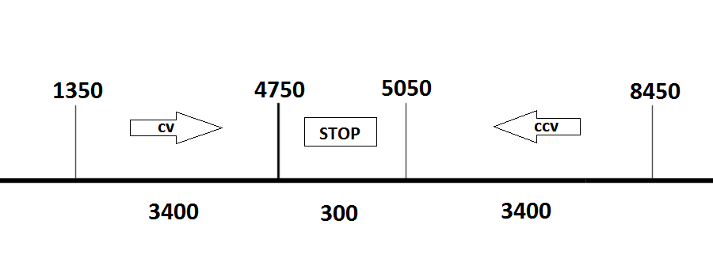

[](https://pypi.org/project/micropython-servo-pdm-360/) 
[](https://pypi.org/project/micropython-servo-pdm-360/)

This is an automatic translation, may be incorrect in some places.
# Servo PDM Continuous
A library for controlling continuous rotation servo drives via the PWM interface of the Raspberry Pi Pico microcontroller in MicroPython.

Library features:
- Rotation with a given force and direction
- Rotation within the specified time
- Possibility of soft start and stop
- Ability to use the [smooth-servo](https://pypi.org/project/smooth-servo/) library to change the smooth start and stop algorithm
- All pending work happens in the background, with two processing options:
     - Using an asyncio task (recommended)
     - Interrupt timer

If you don't need all the functionality listed above, then you should take a look at the [micropython-servo](https://pypi.org/project/micropython-servo/) library.
It is much smaller and better suited for simple tasks.

The following materials were used in the development of the library:
- Material [Principle of operation of constant rotation servos](http://wiki.amperka.ru/articles:servo-pdm-continuous-rotation), author amperka.ru
- Material [Servo Motor with Raspberry Pi Pico using MicroPython](https://microcontrollerslab.com/servo-motor-raspberry-pi-pico-micropython/) by microcontrollerslab.com
- Material [Hobby Servo Tutorial](https://learn.sparkfun.com/tutorials/hobby-servo-tutorial?_ga=2.2724022.723022425.1676642363-1173110823.1674579241) by MIKEGRUSIN and BYRON J. (sparkfun.com)

### Compatibility
- MicroPython 1.19.1
- Raspberry Pi Pico

On the hardware above the library has been tested and works correctly.

### ATTENTION
You use this module at your own risk.
I am new to MicroPython programming. So there may be nuances that I did not take into account.
If you notice an error or have suggestions for improvement, please write to Issues.

## Content
- [Installation](https://github.com/TTitanUA/micropython_servo_pdm_360#install)
- [Initialization](https://github.com/TTitanUA/micropython_servo_pdm_360#init)
- [Documentation](https://github.com/TTitanUA/micropython_servo_pdm_360#doc)
- [Examples](https://github.com/TTitanUA/micropython_servo_pdm_360/tree/main/examples)
- [Bugs and feedback](https://github.com/TTitanUA/micropython_servo_pdm_360#feedback)

<a name="install"></a>
## Installation
- Install the library via pip (Thonny -> Manage Packages) by name **micropython-servo-pdm-360**
- Or manual installation:
   - [Download library from GitHub](https://github.com/TTitanUA/micropython_servo_pdm_360)
   - take the **micropython_servo_pdm_360** folder from the archive.
   - upload to the root of the microcontroller or to the **lib** folder.

If you want to play around with the logic of the library, then the 2nd installation option is preferable. :)

<a name="init"></a>
## Initialization
### Initializing the base library
```python
from machine import Pin, PWM
from micropython_servo_pdm_360 import ServoPDM360

# create a PWM servo controller (21 - pin Pico)
servo_pwm = PWM(Pin(21))

# Set the parameters of the servo pulses, more details in the "Documentation" section
freq = 50
min_us = 400
max_us = 2550
dead_zone_us = 150

# create a servo object
servo = ServoPDM360(pwm=servo_pwm, min_us=min_us, max_us=max_us, dead_zone_us=dead_zone_us, freq=freq)
```

After that, [basic methods](https://github.com/TTitanUA/micropython_servo_pdm_360#doc_base) of controlling the servo will be available to you, which do not require pending tasks.

To access additional methods that require deferred execution, you need to initialize one of the child classes.
Depending on which of the ways you prefer to handle pending tasks:

#### Using the uasyncio library
This is the best option for most projects.
```python
from machine import Pin, PWM
from micropython_servo_pdm_360 import ServoPDM360RP2Async

# create a PWM servo controller (21 - pin Pico)
servo_pwm = PWM(Pin(21))

# Set the parameters of the servo pulses, more details in the "Documentation" section
freq = 50
min_us = 1350
max_us = 8450
dead_zone_us = 300

# create a servo object
servo = ServoPDM360RP2Async(pwm=servo_pwm, min_us=min_us, max_us=max_us, dead_zone_us=dead_zone_us, freq=freq)
```

#### Using timer interrupts
You can read more about timers [here](https://docs.micropython.org/en/latest/library/machine.Timer.html)
For Raspberry Pi Pico [here](https://docs.micropython.org/en/latest/rp2/quickref.html#timers)
Be careful, although this is the easiest option, it is not optimal.
Since the handling of servo events occurs in a timer interrupt, other interrupts will be delayed.
```python
from machine import Pin, PWM
from micropython_servo_pdm_360 import ServoPDM360RP2Irq

# create a PWM servo controller (21 - pin Pico)
servo_pwm = PWM(Pin(21))

# Set the parameters of the servo pulses, more details in the "Documentation" section
freq = 50
min_us = 400
max_us = 2550
dead_zone_us = 150

# create a servo object
servo = ServoPDM360RP2Irq(pwm=servo_pwm, min_us=min_us, max_us=max_us, dead_zone_us=dead_zone_us, freq=freq)
```

<a id="doc"></a>
## Documentation
<a id="doc_pdm"></a>
### A little about PDM
PDM(pulse-duration modulation) is a process of power control by pulsing the power consumer on and off. By Wikipedia®
In our case, it is used to control the servo. According to the pulse time, you can set the force and direction of rotation of the servo.
**ATTENTION:** Unlike PWM, the control is not based on frequency, but on the duration of the pulse.
You can read more here (with pictures): [wiki.amperka.ru](http://wiki.amperka.ru/articles:servo-pdm-continuous-rotation#%D0%B8%D0%BD%D1%82%D0%B5%D1%80%D1%84%D0%B5%D0%B9%D1%81_%D1%83%D0%BF%D1%80%D0%B0%D0%B2%D0%BB%D0%B5%D0%BD%D0%B8%D1%8F)

For the correct operation of the servo, we need to set the following parameters:
- **freq** - pulse frequency, for analog servos 50 Hz. For digital 300 Hz or more.
- **min_us** - minimum pulse time at which the servo begins to rotate in one direction.
- **max_us** - maximum pulse time at which the servo stops rotating in the other direction.
- **dead_zone_us** - duration of the central zone in which the servo does not rotate. This is the transition zone between the two directions of rotation.

Below I tried to graphically represent these parameters for the MG995_360 analog servo:



As we can see in the figure, the servo begins to rotate at a pulse width of 400 µs, and stops rotating at 2600 µs.
Thus, we get the parameters `min_us=400` and `max_us=2550` (2600 - 50, since at 2600 the drive has already stopped). Now we need to find the duration of the central zone.
The figure shows that at a pulse length of 1450 µs, the servo stops rotating clockwise and stops.
Further, at a pulse length of 1600 μs, the rotation in the opposite direction begins. Thus the parameter `dead_zone_us=150` (1600-1450).

Where can I get these parameters for a specific servo? It all depends on the manufacturer. But in most cases they are specified in the documentation.
If not, we pick them up manually using the `set_duty` method and giving different values from 0 to 3000 µs, in 50 µs increments.
An example of such a configuration can be found in the examples folder file [manual_config.py](https://github.com/TTitanUA/micropython_servo_pdm_360/tree/main/examples/manual_config.py).

#### List of parameters for servos:
- **MG995_360** - `min_us=400`, `max_us=2550`, `dead_zone_us=150`, `freq=50`
- **[Com-Motor05(joy it FS90R)](https://joy-it.net/en/products/COM-Motor05)** - `min_us=700`, `max_us=2300`, `dead_zone_us=90`, `freq=50` - By [@philsuess](https://github.com/philsuess)

**PLEASE:** If you find parameters for a servo that are not listed, submit them to me via [issue](https://github.com/TTitanUA/micropython_servo_pdm_360/issues).

### ServoPDM360 constructor parameters
**ServoPDM360RP2Async** and **ServoPDM360RP2Irq** inherit it and have the same parameters

| Parameter    | Type | Default | Description                  |
|--------------|------|---------|------------------------------|
| pwm          | PWM  | None    | PWM controller               |
| min_us       | int  | 500     | Minimum impulse time         |
| max_us       | int  | 3000    | Maximum pulse time           |
| dead_zone_us | int  | 150     | Duration of the central zone |
| freq         | int  | 50      | Pulse frequency              |
| invert       | bool | false   | Direction inversion          |

- `pwm` - [PWM](https://docs.micropython.org/en/latest/library/machine.PWM.html) controller object.
- `min_us` - Minimum pulse time (duty cycle) [More](https://github.com/TTitanUA/micropython_servo_pdm_360#doc_pdm).
- `max_us` - Maximum pulse time (duty cycle) [More](https://github.com/TTitanUA/micropython_servo_pdm_360#doc_pdm)
- `dead_zone_us` - Central zone duration [More](https://github.com/TTitanUA/micropython_servo_pdm_360#doc_pdm)
- `freq` - Pulse frequency, for analog drives it is 50. Digital drives are usually 300 or more.
- `invert` - Invert direction (maybe needed for some drives, maybe not :) )

<a id="doc_base"></a>
### ServoPDM360 base class methods
- `set_duty(duty: int)` - Sets an arbitrary value of the duty cycle in the range from 0 to 65000.
This method is intended for manual search of the minimum and maximum duty cycle values. [More](https://github.com/TTitanUA/micropython_servo_pdm_360#doc_pdm)
- `turn_cv(force: int)` - Starts rotation of the drive clockwise with the given acceleration.
- `turn_ccv(force: int)` - Starts the drive turning counterclockwise at the given acceleration.
- `stop()` - Stops the rotation of the drive.
- `deinit()` - Disables the PWM generator.

### ServoPDM360RP2Async and ServoPDM360RP2Irq class methods
- `turn_cv_ms(...)` - Rotates the drive clockwise with various parameters.
- `turn_ccv_ms(...)` - Rotates the drive counterclockwise with various parameters.

| Parameter       | Type            | Default | Description                                                                                              |
|-----------------|-----------------|---------|----------------------------------------------------------------------------------------------------------|
| time_ms         | int             | 0       | Rotation Time (0 - Infinite)                                                                             |
| force           | int             | None    | Effort, if not specified, is taken from `start_smoothing`                                                |
| start_smoothing | ServoSmoothBase | None    | Start deceleration, if the start is not specified, it will be instantaneous                              |
| end_smoothing   | ServoSmoothBase | None    | Decelerate stop, if not specified stop will be instant                                                   |
| callback        | callable        | None    | The function that will be called after the end of the command. If `time_ms` == 0 then after overclocking |

- `smooth` - Smooth stop of the drive.

| Parameter     | Type            | Default | Description                                                    |
|---------------|-----------------|---------|----------------------------------------------------------------|
| end_smoothing | ServoSmoothBase | None    | Stop slowdown                                                  |
| callback      | callable        | None    | The function that will be called after the end of the command. |

### Slowdowns
To control slowdowns, you can use the `ServoSmoothBase` classes and its descendants.
This library only has `SmoothLinear` linear deceleration, if you need more, install the [smooth-servo](https://pypi.org/project/smooth-servo/) library.
An example of using built-in easing:
```python
from machine import Pin, PWM
from micropython_servo_pdm_360 import ServoPDM360RP2Async, SmoothLinear

# create a PWM servo controller (21 - pin Pico)
servo_pwm = PWM(Pin(21))

# Set the parameters of the servo pulses, more details in the "Documentation" section
freq = 50
min_us = 400
max_us = 2550
dead_zone_us = 150

# create a servo object
servo = ServoPDM360RP2Async(pwm=servo_pwm, min_us=min_us, max_us=max_us, dead_zone_us=dead_zone_us, freq=freq)

# Rotate the actuator clockwise for two seconds with a force of 50 and decelerate at the beginning. After output to the console "callback cv"
servo.turn_cv_ms(2000, 50, start_smoothing=SmoothLinear(50, 1000),  callback=lambda: print("callback cv"))
```
Details about the parameters and types of slowdowns can be found in the [smooth_servo documentation](https://github.com/TTitanUA/smooth_servo#doc).

## Examples
Usage examples can be found in the [examples](https://github.com/TTitanUA/micropython_servo_pdm_360/tree/main/examples)  folder.

<a id="feedback"></a>
## Bugs and feedback
If you find bugs, create [issue](https://github.com/TTitanUA/micropython_servo_pdm_360/issues)
The library is open for further development and your [pull requests](https://github.com/TTitanUA/micropython_servo_pdm_360/pulls)!
